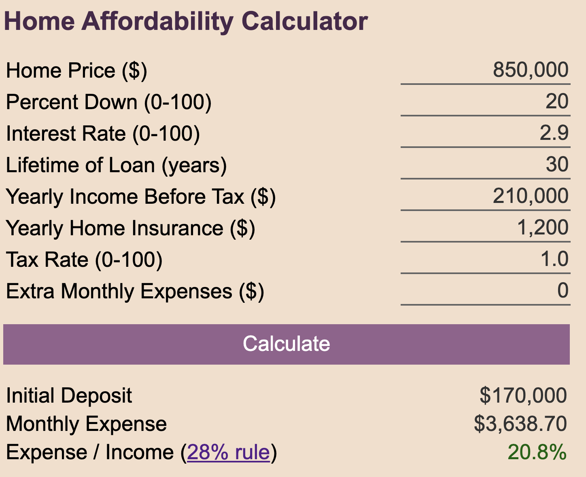
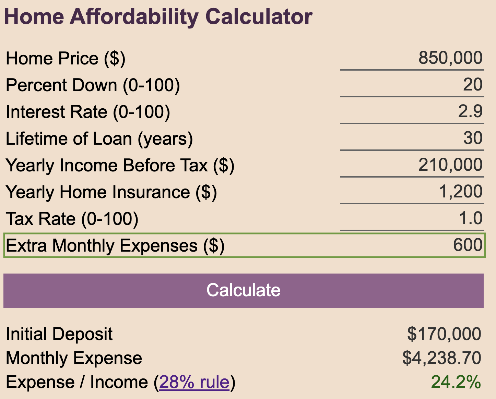

# Home Affordability Calculator

Looking for your next home on Zillow is fun, but knowing whether you can afford
it can be difficult. *What are my total monthly payments including mortgage,
taxes, insurance, and private schools? Do I make enough money to sustain these
payments and keep saving for the future?*

While the exact guidance might be specific to each home buyer, there are some
simple rules of thumb to make the process easier. One popular metric is the
[28% rule](https://www.investopedia.com/terms/t/twenty-eight-thirty-six-rule.asp),
which says that no more than 28% of gross household income
(income before taxes) should go to housing expenses.

I found myself manually recalculating *expense-over-income* percentage a couple
of times per year, and tinkering with different inputs (home prices, interest
rates, etc.) to see whether the percentage is comfortably below 28%. To save
time, I built this tool to make home buying analysis faster (and it gave me an
opportunity to get some reps with javascript and HTML).

[Play around with it!](https://raw.githack.com/ronnyvotel/mortgage-calculator/master/index.html)

## A working Example

Alice and Bob are in the market for a new home. They found a house on Redfin for
**$850k**. They are pre-approved for a 30-year loan at a **2.9% interest rate**,
and plan to make an initial **20% down payment**.

The **property tax on the home is 1%**, and **home insurance will cost
$1200/yr**.

Both Alice and Bob are employed, and their **gross yearly income (before taxes and
deductions) is $210k**.

Alice and Bob populate the information into the *Home Affordability Calculator*
and determine that after their **down payment of $170k**, they will have a
**monthly payment (which includes principle, interest, taxes, and insurance) of
$3683.70**.

That seems like a lot of money, but it accounts for only **20.8% of their
income**, safely below the recommended ceiling of 28%.

Later, Alice remembers that this new home is in a gated community which has a
$600/month [HOA fee](https://www.investopedia.com/terms/h/homeowners-association-fee-hoa.asp). This should also be factored into the
budget. Thankfully, there is one other input field called *Extra Monthly
Expenses*, which can capture things like HOA fees, or even private school
tuitions if they are a consideration for a housing change.

The new expense / income percentage is 24.2%, close to the recommended
maximum of 26%. If both Alice and Bob continue to work, and if they don't have
other large debts (cars, student loans, etc.), they can likely afford this home
and still have income left over for savings, investments, and discretionary
expenses.

## Feedback

I'm not a financial advisor (far from it). If you see anything else that should
be considered in the roll-up, let me know!